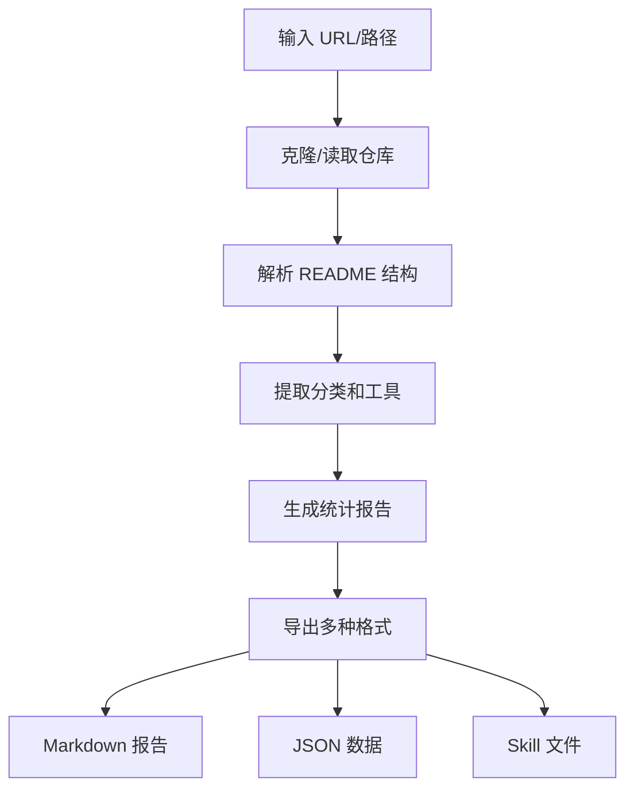

# Awesome List Analyzer Skill

> 分析 awesome 列表仓库，提取工具并生成结构化评估报告

## 用途

本 Skill 用于分析 GitHub 上的 awesome 列表仓库，自动：
1. 克隆仓库并解析 README 结构
2. 提取分类和工具列表
3. 生成统计报告和推荐
4. 导出为多种格式（Markdown、JSON、Skill）

## 输入

- GitHub awesome 仓库 URL（如 `https://github.com/techiediaries/awesome-vibe-coding`）
- 或本地 awesome 列表的 README.md 文件路径

## 输出

```
output/
├── analysis.md          # 完整的分析报告
├── summary.json         # 结构化数据
└── skills/              # 按分类导出的 skill 格式
    ├── category-1.md
    ├── category-2.md
    └── ...
```

## 使用方法

### 命令行方式

```bash
# 分析远程仓库
python awesome-analyzer/scripts/analyze.py https://github.com/user/awesome-list

# 分析本地文件
python awesome-analyzer/scripts/analyze.py /path/to/README.md

# 指定输出目录
python awesome-analyzer/scripts/analyze.py https://github.com/user/awesome-list --output ./my-analysis

# 导出为 skill 格式
python awesome-analyzer/scripts/analyze.py https://github.com/user/awesome-list --export-skills

# 限制显示工具数量
python awesome-analyzer/scripts/analyze.py https://github.com/user/awesome-list --max-tools 50
```

### 参数说明

| 参数 | 说明 | 默认值 |
|------|------|--------|
| `source` | 仓库 URL 或本地路径（必填） | - |
| `--output`, `-o` | 输出目录 | `./awesome-analysis` |
| `--export-skills`, `-s` | 导出为 skill 格式 | False |
| `--max-tools`, `-m` | 每类最大工具数 | 100 |
| `--format`, `-f` | 输出格式 (markdown/json/all) | all |

## 报告结构

### 1. 统计概览
- 分类数量
- 工具总数
- 有链接的工具数
- 分类分布图表

### 2. 分类详细分析
- 每个分类的描述
- 工具列表（含链接、描述、标签）
- 工具数量统计

### 3. 重点推荐
根据分类重要性自动识别重点工具：
- AI IDEs / Editors
- Cloud-Based Tools
- Core Assistants
- etc.

### 4. 数据导出
- 完整的 JSON 数据
- 可按需进一步处理

## 前置要求

```bash
# 无需额外依赖，仅使用 Python 标准库
# Python 3.8+
```

## 示例

### 示例 1：分析 awesome-vibe-coding

```bash
python awesome-analyzer/scripts/analyze.py \
  https://github.com/techiediaries/awesome-vibe-coding \
  --output ./vibe-coding-analysis \
  --export-skills
```

输出：
```
🔍 正在分析 awesome-vibe-coding 列表...
📋 发现 10 个分类
📦 提取 40+ 个工具
✅ 报告已保存: ./vibe-coding-analysis/analysis.md
✅ 已导出 10 个 skill 文件
```

### 示例 2：分析本地 awesome 列表

```bash
python awesome-analyzer/scripts/analyze.py \
  ./my-awesome-list/README.md \
  --format json
```

## 工作原理



1. **仓库获取**：克隆远程仓库或读取本地文件
2. **结构解析**：识别目录结构和分类标题
3. **工具提取**：使用正则表达式提取工具名称、链接、描述
4. **标签生成**：基于描述自动提取关键词标签
5. **报告生成**：生成统计概览和详细分析
6. **格式导出**：支持 Markdown、JSON、Skill 格式

## 最佳实践

### 输入要求

awesome 列表应遵循标准格式：
```markdown
## Category Name

Description of this category...

- [Tool Name](https://tool-url.com): Tool description here
- [Another Tool](https://another.com): Another description
```

### 输出利用

1. **analysis.md** - 人工阅读和分享
2. **summary.json** - 程序化进一步处理
3. **skills/** - 导入到 fire-skills 作为参考资源

## 相关 Skill

| Skill | 说明 |
|-------|------|
| [tech-research](../tech-research/SKILL.md) | 对提取的工具进行深度调研 |
| [github-cli-skill](../github-cli-skill/SKILL.md) | 获取工具的 GitHub 数据 |
| [project-analysis-skill](../../product/project-analysis-skill/SKILL.md) | 评估工具的技术可行性 |

## 安装

### 项目级安装

```bash
# macOS / Linux
./scripts/install.sh --project

# Windows PowerShell
.\scripts\install.ps1 -Project
```

### 系统级安装

```bash
# macOS / Linux
./scripts/install.sh --system

# Windows PowerShell
.\scripts\install.ps1 -System
```
