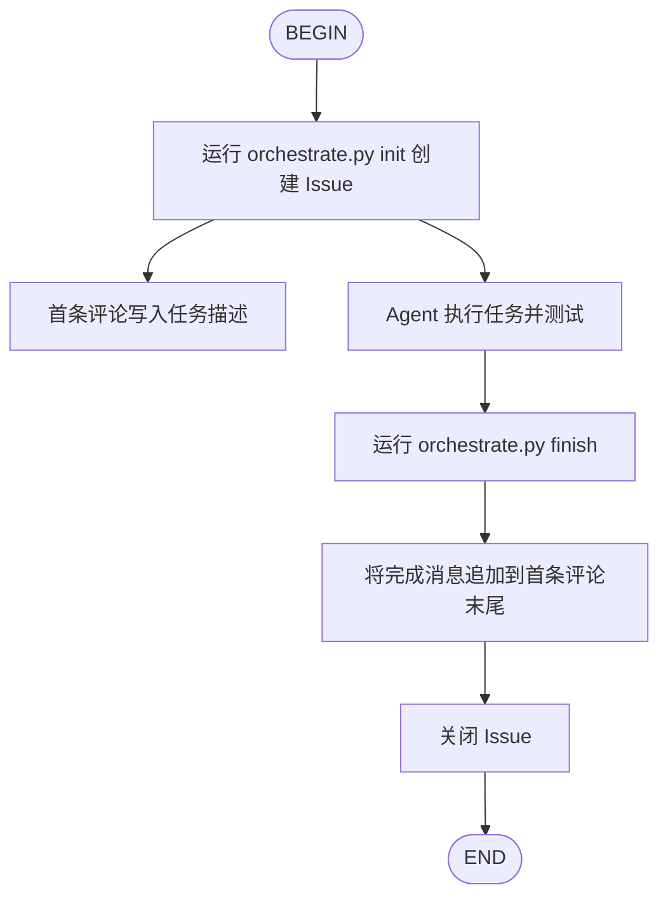

# Git Workflow

基于 [github-cli-skill](../github-cli-skill/SKILL.md) 构建的 Issue 管理工作流。

## 工作流步骤



### 步骤说明

1. **INIT** — 创建 Issue
   - 运行：`python git-workflow/scripts/orchestrate.py init --title "标题" --description "任务描述"`
   - 创建 GitHub Issue
   - 将任务描述作为**首条评论**写入
   - 保存工作流状态到 `.git-workflow.state.json`

2. **IMPLEMENT** — Agent 执行任务
   - 根据任务描述执行代码修改
   - 运行测试并修复问题

3. **FINISH** — 关闭 Issue
   - 运行：`python git-workflow/scripts/orchestrate.py finish --message "完成总结"`
   - **追加**完成消息到首条评论末尾（不覆盖原内容）
   - 关闭 Issue
   - 清理状态文件

## 前置要求

需要安装 GitHub CLI 并登录：

```bash
# macOS
brew install gh

# Linux
# 参见 https://github.com/cli/cli#installation

# 登录
gh auth login
```

## 脚本说明

### 创建 Issue

```bash
python git-workflow/scripts/create_issue.py \
  --title "实现登录功能" \
  --description "需要实现用户登录功能，包括..." \
  --labels "task,enhancement"
```

| 参数 | 说明 |
|------|------|
| `--title` | Issue 标题（必填） |
| `--description` | 任务描述，会写入首条评论（必填） |
| `--labels` | 逗号分隔的标签，默认 `task` |
| `--repo` | 手动指定仓库 `owner/repo`，不填则自动检测 |
| `--remote` | 指定 git remote，默认 `origin` |

### 关闭 Issue（追加评论）

```bash
python git-workflow/scripts/close_issue.py \
  --message "已完成登录功能实现。修改了 src/auth.py，添加了 JWT 验证。"
```

| 参数 | 说明 |
|------|------|
| `--message` | 追加到首条评论的完成消息（必填） |
| `--issue` | Issue 编号（覆盖状态文件） |
| `--repo` | 仓库（覆盖状态文件） |

**重要**：`--message` 会被追加到首条评论的末尾，**不会**覆盖原始任务描述。

### 编排器

```bash
# 初始化工作流
python git-workflow/scripts/orchestrate.py init \
  --title "任务标题" \
  --description "任务描述"

# 查看状态
python git-workflow/scripts/orchestrate.py status

# 完成工作流
python git-workflow/scripts/orchestrate.py finish \
  --message "任务已完成。测试通过。"

# 中止工作流（不关闭 Issue）
python git-workflow/scripts/orchestrate.py abort
```

## 快速参考

| 操作 | 命令 |
|------|------|
| 创建工作流 | `python scripts/orchestrate.py init --title "..." --description "..."` |
| 完成工作流 | `python scripts/orchestrate.py finish --message "..."` |
| 查看状态 | `python scripts/orchestrate.py status` |
| 中止工作流 | `python scripts/orchestrate.py abort` |

## 安装

### 项目级安装

```bash
# macOS / Linux
./scripts/install.sh --project

# Windows PowerShell
.\scripts\install.ps1 -Project
```

### 系统级安装

```bash
# macOS / Linux
./scripts/install.sh --system

# Windows PowerShell
.\scripts\install.ps1 -System
```

### 指定 Agent

```bash
# 仅安装到 Kimi
./scripts/install.sh --system --agent kimi

# Windows
.\scripts\install.ps1 -System -Agent kimi
```

## Git Hooks

git-workflow 提供两个 Git Hook，用于自动关联提交和 Issue：

### prepare-commit-msg

当分支名以 Issue 编号开头时（如 `42-feature-login`），自动在提交信息末尾追加 `Refs: #42`。

```bash
# 安装
cp git-workflow/hooks/prepare-commit-msg .git/hooks/
chmod +x .git/hooks/prepare-commit-msg
```

### post-commit

每次提交后自动在关联的 GitHub Issue 下添加评论，记录提交 hash、消息和分支。

```bash
# 安装
cp git-workflow/hooks/post-commit .git/hooks/
chmod +x .git/hooks/post-commit
```

## Kimi Hooks

### kimi-auto-issue.sh (PostToolUse)

当在 `tasks/` 目录下写入 `.md` 文件时，自动创建 GitHub Issue。

```bash
# 在 ~/.kimi/config.toml 中配置
[[hooks]]
event = "PostToolUse"
command = "/path/to/git-workflow/hooks/kimi-auto-issue.sh"
```

### kimi-stop-update.sh (Stop)

当 Kimi 会话结束时，自动在活跃的 Issue 下添加评论。

```bash
# 在 ~/.kimi/config.toml 中配置
[[hooks]]
event = "Stop"
command = "/path/to/git-workflow/hooks/kimi-stop-update.sh"
```

## Claude Code 集成

### 自动触发 Hook

安装 `claude-auto-issue.sh` 到项目级 `.claude/settings.json`：

```json
{
  "hooks": {
    "UserPromptSubmit": [
      {
        "matcher": "*",
        "hooks": [
          {
            "type": "command",
            "command": "bash dev/git-workflow/hooks/claude-auto-issue.sh",
            "timeout": 10
          }
        ]
      }
    ]
  }
}
```

Hook 会检测任务执行相关的 prompt（如"执行任务"、"execute task"、"Task 9"等），并自动注入上下文提醒 Agent 使用 git-workflow。

### CLAUDE.md 指令

在项目根目录的 `CLAUDE.md` 中添加 git-workflow 指令，确保 Claude Code 在每次会话加载时都能看到任务执行必须走 git-workflow 的规则。

## 相关文档

| 文档 | 说明 |
|------|------|
| [references/workflow.md](references/workflow.md) | 工作流详细参考 |
