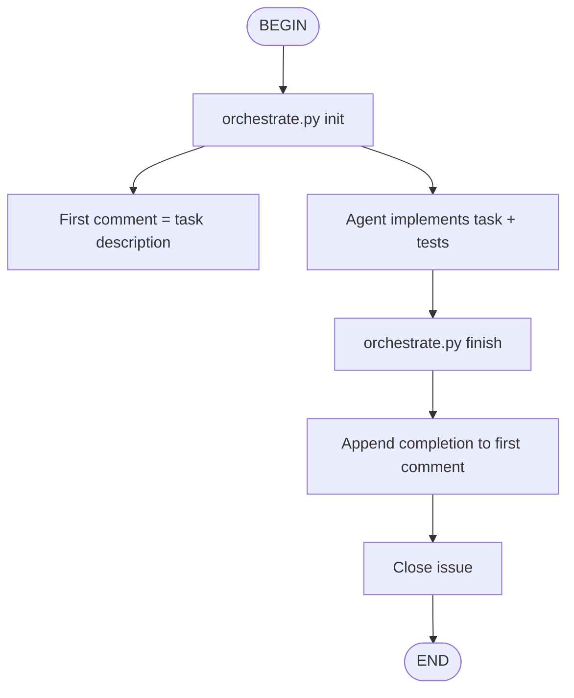

# Git Workflow Reference

## Workflow Overview



## Manual Steps

### 1. Create Issue

```bash
python git-workflow/scripts/orchestrate.py init \
  --title "Task title" \
  --description "Task description" \
  --labels "task"
```

### 2. Implement Task

Edit code, run tests, fix issues.

### 3. Close Issue

```bash
python git-workflow/scripts/orchestrate.py finish \
  --message "Completion summary"
```

## Git Hooks

### prepare-commit-msg

Auto-appends `Refs: #<issue>` to commit messages when branch name starts with issue number.

**Example**: branch `42-feature-login` → commit message gets `Refs: #42`

### post-commit

Auto-comments on the GitHub issue after each commit with commit hash, message, and branch.

## Kimi Hooks

### kimi-auto-issue.sh (PostToolUse)

Auto-creates a GitHub issue when a `.md` file in `tasks/` directory is written.

### kimi-stop-update.sh (Stop)

Auto-comments on the active issue when the Kimi session ends.

## State File

`.git-workflow.state.json` tracks the active workflow:

```json
{
  "issue": 42,
  "repo": "owner/repo",
  "first_comment_id": 1234567890,
  "description": "Original task description",
  "title": "Task title"
}
```
