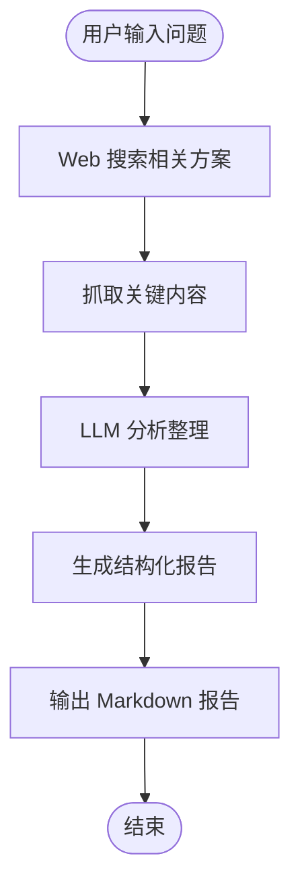

# Tech Research Skill

技术问题解决方案搜索与分析工具。通过 Web 搜索获取多种解决方案，并生成结构化分析报告。

## 工作流程



## 使用方法

### 命令行方式

```bash
# 搜索技术问题解决方案
python tech-research/scripts/research.py "如何优化 Webpack 构建速度"

# 对比多个技术方案
python tech-research/scripts/research.py "React 状态管理方案对比" --compare

# 指定输出文件
python tech-research/scripts/research.py "Next.js vs Nuxt.js" --output report.md

# 限制搜索结果数量
python tech-research/scripts/research.py "Docker 最佳实践" --results 10
```

### 参数说明

| 参数 | 说明 | 默认值 |
|------|------|--------|
| `query` | 搜索查询（必填） | - |
| `--compare` | 启用对比模式 | False |
| `--results` | 搜索结果数量 | 5 |
| `--output` | 输出文件路径 | 终端输出 |
| `--format` | 输出格式 (markdown/json) | markdown |

## 报告结构

生成的报告包含以下章节：

### 1. 问题概述
- 用户问题的核心要点提炼
- 关键挑战识别

### 2. 解决方案列表
- 搜索到的多种解决方案
- 每种方案的基本信息

### 3. 方案对比分析

| 维度 | 说明 |
|------|------|
| **技术成熟度** | 稳定性、社区活跃度、维护状态、版本历史 |
| **优缺点** | 各方案的优势和局限性 |
| **适用场景** | 什么情况下适合使用该方案 |
| **学习曲线** | 上手难度、文档质量、社区支持 |

### 4. 推荐方案
- 综合评分最高的方案
- 推荐理由
- 风险提示

### 5. 实施建议
- 具体的执行步骤
- 最佳实践
- 常见陷阱

### 6. 参考来源
- 引用的网页链接
- 相关资源

## 前置要求

### 安装依赖

```bash
pip install duckduckgo-search requests beautifulsoup4
```

### 可选依赖（用于更好的内容抓取）

```bash
pip install trafilatura  # 更好的网页内容提取
```

## 示例

### 示例 1：搜索性能优化方案

```bash
python tech-research/scripts/research.py "React 应用性能优化"
```

输出示例：
```markdown
# React 应用性能优化 - 技术调研报告

## 问题概述
针对 React 应用运行时的性能瓶颈，寻找有效的优化策略和工具。

## 解决方案列表

### 1. React.memo + useMemo/useCallback
- 通过记忆化避免不必要的重渲染

### 2. 虚拟列表 (react-window/react-virtualized)
- 处理大数据列表渲染性能

### 3. 代码分割 (React.lazy + Suspense)
- 按需加载，减少初始包体积

### 4. Web Workers
- 将计算密集型任务移出主线程

## 方案对比分析

| 方案 | 成熟度 | 优点 | 缺点 | 适用场景 | 学习曲线 |
|------|--------|------|------|----------|----------|
| React.memo | ⭐⭐⭐⭐⭐ | 官方支持，简单易用 | 过度使用可能导致内存问题 | 组件频繁重渲染 | 低 |
| 虚拟列表 | ⭐⭐⭐⭐ | 大幅提升长列表性能 | 需要重构列表组件 | 大数据列表 | 中 |
| 代码分割 | ⭐⭐⭐⭐⭐ | 减少首屏加载时间 | 需要处理加载状态 | 大型应用 | 低 |
| Web Workers | ⭐⭐⭐ | 释放主线程 | 通信复杂，调试困难 | 计算密集型任务 | 高 |

## 推荐方案

**首选：代码分割 + React.memo 组合**

推荐理由：
1. 投入产出比最高，能快速见效
2. 官方支持，风险低
3. 学习成本低，团队易上手

## 实施建议

1. 首先使用 React DevTools Profiler 定位性能瓶颈
2. 对高频重渲染组件使用 React.memo
3. 对路由级别进行代码分割
4. 大数据列表考虑虚拟列表方案

## 参考来源
- [React 官方性能优化文档](https://react.dev/reference/react)
- [Web.dev 性能优化指南](https://web.dev/performance-react/)
```

### 示例 2：技术方案对比

```bash
python tech-research/scripts/research.py "Zustand vs Redux vs MobX" --compare
```

## 安装

### 项目级安装

```bash
# macOS / Linux
./scripts/install.sh --project

# Windows PowerShell
.\scripts\install.ps1 -Project
```

### 系统级安装

```bash
# macOS / Linux
./scripts/install.sh --system

# Windows PowerShell
.\scripts\install.ps1 -System
```

## 工作原理

1. **Web 搜索**：使用 DuckDuckGo 搜索相关技术方案
2. **内容抓取**：抓取搜索结果页面的关键内容
3. **LLM 分析**：使用 LLM 分析整理信息，提取关键维度
4. **报告生成**：生成结构化的 Markdown 报告

## 注意事项

- 搜索结果受网络环境影响
- 报告内容基于公开信息，建议结合实际项目需求判断
- 技术方案会随时间变化，建议查看最新的官方文档

## 相关 Skill

| Skill | 说明 |
|-------|------|
| [github-cli-skill](../github-cli-skill/SKILL.md) | GitHub 操作工具 |
| [git-workflow](../git-workflow/SKILL.md) | Git 工作流管理 |
