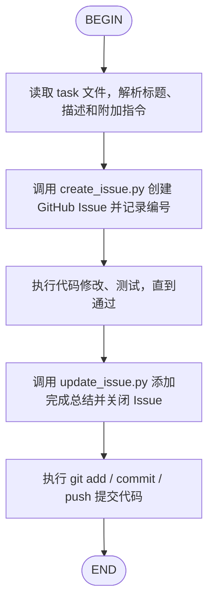

# GitHub Task Workflow

通过 GitHub Issues 管理任务的全生命周期：读取、创建、实现、更新、提交。

> 本 Skill 兼容 Claude Code、Kimi CLI、Codex 和 OpenCode。

## 使用方式

### 方式 A：普通对话模式（推荐）

直接对 AI 说：

> "请执行 `tasks/login-refactor.md`，要求使用 JWT 实现登录，并走完整的 GitHub Task Workflow。"

AI 读取本 Skill 后，应自动按以下步骤执行：
1. 读取 task 文件
2. 创建 GitHub Issue
3. 执行代码修改和测试
4. 更新并关闭 Issue
5. 提交代码

### 方式 B：编排器模式（跨 Agent）

使用 orchestrate.py 脚本管理整个工作流：

```bash
# 初始化：创建 Issue
python github-task-workflow/scripts/orchestrate.py init tasks/my-task.md

# AI 实现任务...

# 完成：更新 Issue 并关闭
python github-task-workflow/scripts/orchestrate.py finish
```

### 方式 C：Kimi CLI 自定义 Agent

使用强制工作流模式的自定义 Agent：

```bash
kimi --agent-file github-task-workflow/agent/kimi-agent.yaml
```

在这种模式下，只要提到 task 文件，Agent 会自动执行完整工作流。

## 自动化流程



### 节点说明

**READ**
- 读取用户指定的 task 文件（如 `tasks/xxx.md`）
- 第一行（去除 `# `）作为 Issue 标题
- 全文作为 Issue 描述
- 解析用户附加的实现指令

**CREATE**
- 运行：`python scripts/create_issue.py --title "..." --body "..." --labels "task"`
- 记录返回的 Issue 编号
- 将 Issue 编号写入 `.github-task-workflow.active-issue`

**IMPLEMENT**
- 根据 task 内容和附加指令执行代码修改
- 运行相关测试，修复直到通过
- 如有需要，更新文档

**UPDATE**
- 运行：`python scripts/update_issue.py --issue <编号> --comment "..." --state closed`
- 评论中应包含：主要修改文件、关键设计决策、测试结果、PR/Commit 链接

**COMMIT**
- `git add .`
- `git commit -m "... (Refs: #<编号>)"`
- `git push`

## 相关文档

| 文档 | 说明 |
|------|------|
| [references/workflow.md](references/workflow.md) | 工作流详细参考 |
| [references/automation-hooks.md](references/automation-hooks.md) | 自动化方案（Git Hooks、GitHub Actions、Watcher、Kimi Hooks） |
| [references/full-auto-roadmap.md](references/full-auto-roadmap.md) | 全自动化路线图 |
| [../docs/Agents.md](../docs/Agents.md) | 支持的 AI Agent 工具介绍和配置说明 |
| [../docs/ai-coding-tools-guide.md](../docs/ai-coding-tools-guide.md) | AI 编程工具配置指南（Claude Code、Codex、aider、GLM） |

## 脚本说明

所有脚本位于 `scripts/` 目录。

### 创建 Issue

```bash
python github-task-workflow/scripts/create_issue.py \
  --title "实现登录功能" \
  --body "$(cat tasks/login.md)" \
  --labels "enhancement,task"
```

| 参数 | 说明 |
|------|------|
| `--title` | Issue 标题（必填） |
| `--body` | Issue 内容，支持 Markdown（必填） |
| `--labels` | 逗号分隔的标签 |
| `--repo` | 手动指定仓库 `owner/repo`，不填则自动从 git remote 检测 |
| `--remote` | 指定 git remote 名称，默认 `origin` |
| `--token` | GitHub Token，不填则从配置链读取 |

### 更新 Issue

```bash
python github-task-workflow/scripts/update_issue.py \
  --issue 123 \
  --comment "## 完成\n\n- 修改了 src/auth.py\n- PR: #456" \
  --state closed
```

| 参数 | 说明 |
|------|------|
| `--issue` | Issue 编号（必填） |
| `--comment` | 添加一条评论 |
| `--body` | 直接修改 Issue 正文 |
| `--append` | 将 `--body` 追加到原正文末尾 |
| `--state` | 修改状态：`open` 或 `closed` |
| `--repo` | 手动指定仓库 `owner/repo`，不填则自动检测 |
| `--token` | GitHub Token，不填则从配置链读取 |

### 编排器

```bash
# 初始化工作流
python github-task-workflow/scripts/orchestrate.py init tasks/my-task.md [附加指令]

# 查看状态
python github-task-workflow/scripts/orchestrate.py status

# 完成工作流
python github-task-workflow/scripts/orchestrate.py finish

# 中止工作流
python github-task-workflow/scripts/orchestrate.py abort
```

## 仓库自动检测

脚本默认从当前目录的 git 配置中推断 GitHub 仓库：

```bash
# 从 origin remote 自动获取
python github-task-workflow/scripts/create_issue.py --title "Task" --body "Desc"

# 使用 upstream remote
python github-task-workflow/scripts/create_issue.py --remote upstream --title "Task" --body "Desc"

# 显式覆盖
python github-task-workflow/scripts/create_issue.py --repo "owner/other-repo" --title "Task" --body "Desc"
```

## 配置 GitHub Token

脚本按以下优先级读取 Token：

1. **命令行参数**：`--token ghp_xxx`
2. **环境变量**：`export GITHUB_TOKEN="ghp_xxx"`
3. **项目级配置**：`.github-task-workflow.yaml`
4. **全局配置**：`~/.config/github-task-workflow/config.yaml`

### 初始化配置文件

```bash
# 初始化全局配置
python github-task-workflow/scripts/config_loader.py --init-global

# 初始化当前项目的配置
python github-task-workflow/scripts/config_loader.py --init-project

# 查看当前配置来源
python github-task-workflow/scripts/config_loader.py --show-sources
```

### 配置示例

```yaml
# .github-task-workflow.yaml
github:
  token: ghp_your_token_here
  # repo: owner/repo  # 可选：覆盖自动检测
```

## Git Hooks

项目已配置以下 Git Hooks：

- **prepare-commit-msg**: 自动在提交信息追加 `Refs: #<issue>`
- **post-commit**: 自动向关联的 GitHub Issue 添加提交评论

分支名格式：`42-feature-name`（以 Issue 编号开头）

## 完整命令示例

### 普通对话模式（最常用）

```bash
# 直接对 AI 说：
# "请执行 tasks/auth-refactor.md，要求使用 JWT 实现登录"
```

### 编排器模式

```bash
# Step 1: 初始化工作流
python github-task-workflow/scripts/orchestrate.py init tasks/auth-refactor.md

# Step 2: AI 实现任务...

# Step 3: 完成并关闭
python github-task-workflow/scripts/orchestrate.py finish
```

### 分步手动模式

```bash
# Step 1: 创建 Issue
ISSUE=$(python github-task-workflow/scripts/create_issue.py \
  --title "重构用户认证模块" \
  --body "$(cat tasks/auth-refactor.md)" \
  --labels "refactor,high-priority" \
  --output-json | jq -r '.number')

echo "Created Issue: #$ISSUE"

# Step 2: AI 实现任务...

# Step 3: 更新并关闭 Issue
python github-task-workflow/scripts/update_issue.py \
  --issue "$ISSUE" \
  --comment "## Implementation Summary\n\n- 重构了 auth/service.go\n- 添加了 JWT 刷新逻辑" \
  --state closed
```
