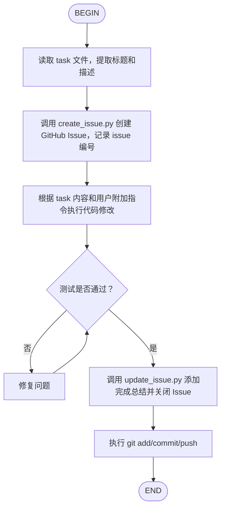

# GitHub Task Workflow 全自动化路线图

用户目标：在 Kimi CLI YOLO 模式下，输入"执行 `tasks/xxx.md` 以及附加指令"，AI 自动完成：

```
读取 task -> 创建 Issue -> AI 执行任务 -> 更新 Issue -> 提交代码
```

## 现状：能做到什么？

| 步骤 | 当前状态 | 说明 |
|------|---------|------|
| **读取 task** | ✅ 可以 | Kimi 作为 AI 可以直接 `ReadFile` 读取 task 文件 |
| **创建 Issue** | ✅ 可以 | 通过 `scripts/create_issue.py` 可以创建 |
| **AI 执行任务** | ✅ 可以 | YOLO 模式下 AI 自动调用工具执行代码修改 |
| **更新 Issue** | ✅ 可以 | 通过 `scripts/update_issue.py` 可以更新 |
| **提交代码** | ✅ 可以 | 通过 `Shell` 工具执行 `git add/commit/push` |
| **自动串联** | ❌ **不能** | 需要一个"编排器"告诉 AI 必须按这个顺序执行 |

## 为什么不能 100% 自动？

当前 `github-task-workflow` 只是一个 **Skill（说明书）**，它的工作方式是：

1. Kimi 启动时看到 `SKILL.md` 的描述
2. 当用户聊到相关话题时，Kimi **可能** 读取 `SKILL.md` 的详细内容
3. 然后 Kimi **自己决定** 要不要调用 `create_issue.py`

这里的问题：

- **没有强制入口**：用户说"执行 task"，Kimi 可能只执行代码修改，**不一定** 会想到先创建 Issue
- **没有状态机**：创建 Issue 后，Kimi 不会自动记得"执行完后还要更新 Issue"
- **Hooks 不是编排器**：`PostToolUse` / `Stop` hook 只能在**单个事件点**触发脚本，无法在一个会话内编排"创建 -> 执行 N 步 -> 更新 -> 提交"的完整流程
- **YOLO 模式不读心**：YOLO 只是"自动批准工具调用"，不是"自动理解并执行复杂工作流"

## 要实现全自动，必须引入"流程编排"

### 方案 1：Flow Skill（最推荐，原生支持）

Kimi CLI 支持一种特殊的 Skill 类型叫 **Flow Skill**（`type: flow`）。它通过在 `SKILL.md` 中内嵌流程图（Mermaid 或 D2），定义多步骤工作流。

**调用方式**：

```bash
/flow:github-task-workflow tasks/login-refactor.md "使用 JWT 实现"
```

**优点**：
- Kimi CLI 原生支持
- 按流程图节点顺序自动执行
- 每个节点可以调用工具（Shell、WriteFile 等）
- 在 YOLO 模式下可以连续自动执行

**缺点**：
- 用户需要显式使用 `/flow:` 命令（不能直接说"执行这个 task"）
- 复杂分支（如执行失败重试）需要 Agent 输出 `<choice>分支名</choice>`

### 方案 2：增强 SKILL.md + 强提示词（次推荐，简单）

在 `SKILL.md` 中增加一个"强制工作流"章节，明确告诉 AI：

> "当用户要求'执行 task 文件'时，你必须按以下顺序执行：1. 读取文件 2. 创建 Issue 3. 执行代码修改 4. 更新并关闭 Issue 5. 提交代码"

**优点**：
- 无需额外文件，直接改 `SKILL.md`
- 用户仍然用自然语言触发

**缺点**：
- 依赖 AI 的"自觉性"，不是 100% 可靠
- 长会话中 AI 可能中途遗忘步骤

### 方案 3：自定义 Kimi Agent（高阶，最稳定）

编写一个自定义 `agent.yaml`，在系统提示词（system prompt）中固化规则：

```yaml
version: 1
agent:
  extend: default
  system_prompt_path: ./system.md
```

在 `system.md` 中写入：

```markdown
## GitHub Task Workflow 强制规则

当用户要求你"执行某个 task 文件"（如 `tasks/*.md`）时，你必须按以下顺序执行，不得跳过任何步骤：

1. **ReadFile** 读取 task 文件，提取标题和描述
2. **Shell** 调用 `python .kimi/skills/github-task-workflow/scripts/create_issue.py --title "..." --body "..."`
3. 执行用户要求的代码修改和测试
4. **Shell** 调用 `python .kimi/skills/github-task-workflow/scripts/update_issue.py --issue <number> --comment "..." --state closed`
5. **Shell** 执行 `git add . && git commit -m "..." && git push`

你必须在每一步完成后确认结果，再进行下一步。
```

**优点**：
- 最稳定，规则写在系统层
- 不需要用户记 `/flow:` 命令

**缺点**：
- 需要额外维护一个 Agent 配置文件
- 每次启动 Kimi 时要带 `--agent-file` 参数

### 方案 4：Kimi Plugin + 封装脚本（技术性强）

写一个 `plugin.json` 声明一个工具 `run_task_workflow(task_file, instructions)`，工具内部调用一个 bash/python 脚本来：

1. 读取 task 文件
2. 创建 Issue
3. 调用 `kimi` 子命令执行代码修改（或把修改任务交给当前 Agent）
4. 更新 Issue
5. 提交代码

**优点**：
- AI 只需要调用一个工具
- 逻辑集中在一个脚本里

**缺点**：
- Plugin 内部无法使用 Kimi 的 AI 能力做代码修改（第 3 步需要再开一个 kimi 进程，或当前 Agent 仍然要参与）
- 实现复杂，调试困难

## 推荐实现

### 短期：方案 1 + 方案 2 组合

1. **把 `github-task-workflow` 升级为 Flow Skill**：用户可以通过 `/flow:github-task-workflow tasks/xxx.md` 一键触发完整流程
2. **在普通 `SKILL.md` 中增加强提示词**：当用户不用 `/flow:` 而是直接说"执行 task"时，AI 也能大概率按流程执行

### 长期：方案 3

如果未来这个工作流成为主要开发模式，可以创建一个自定义 Agent，把规则固化到系统提示词中。

## Flow Skill 设计草案

```markdown
---
name: github-task-workflow
description: 执行 task 文件的全自动工作流：读取 -> 创建 Issue -> 实现 -> 更新 Issue -> 提交
type: flow
---


```

用户调用：

```bash
/flow:github-task-workflow tasks/login-refactor.md "使用 JWT 替代 Session"
```

## 结论

- **现在就能做的**：手动在对话中分步引导 AI 完成（读取 -> 创建 -> 执行 -> 更新 -> 提交）
- **下一步要做的**：创建 Flow Skill 或增强 SKILL.md 的强制提示词
- **还不能做的**：用户只说"执行这个 task"，AI 就 100% 自动走完整个流程且不遗漏步骤
