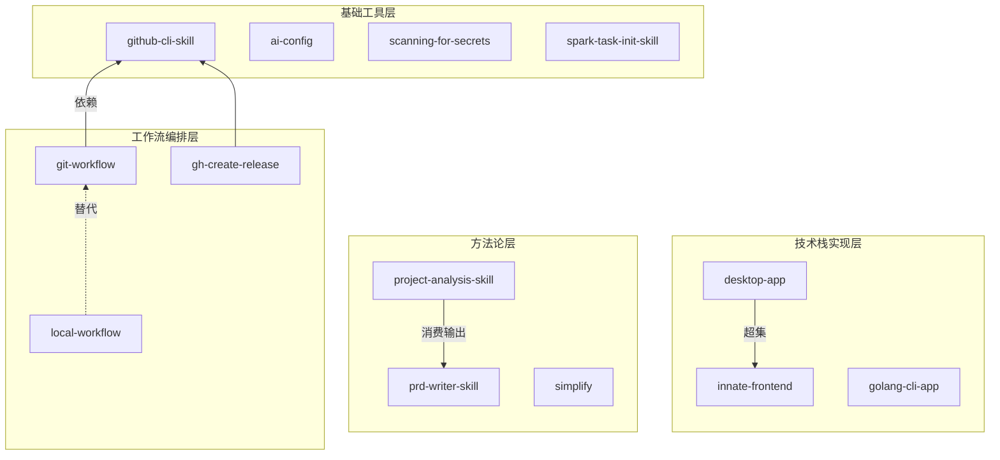
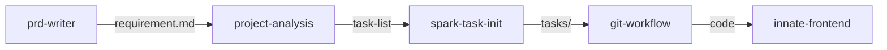
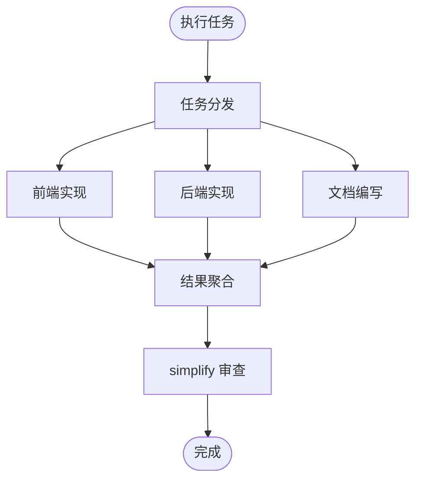
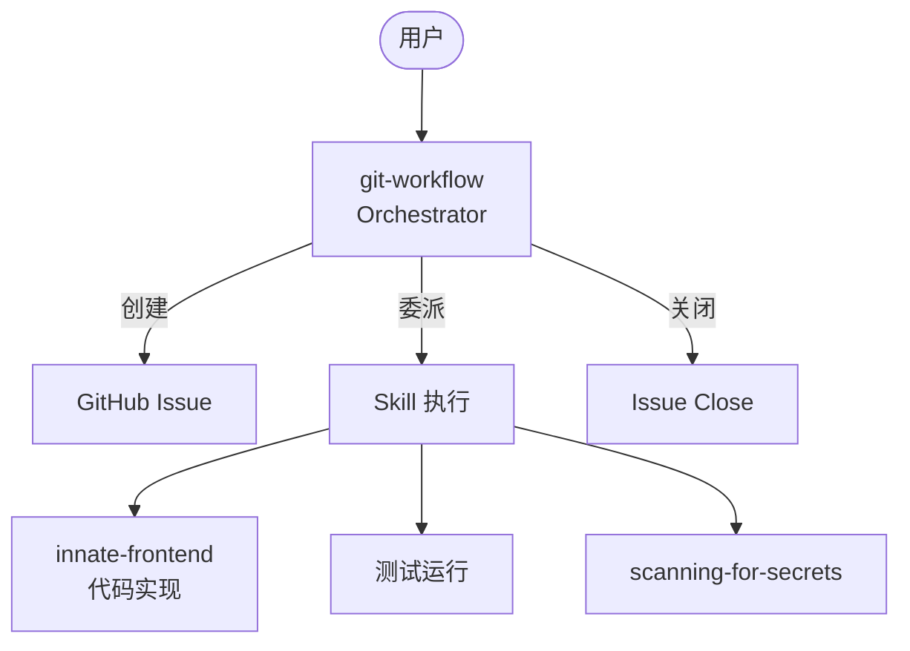
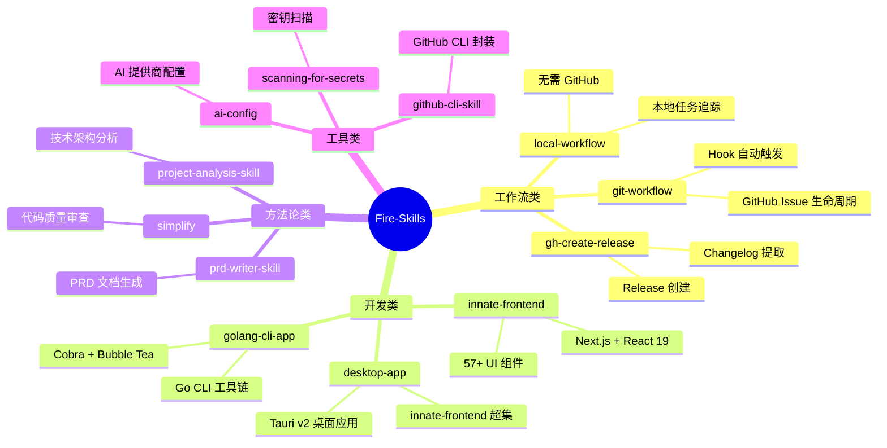

# Skill Composition 深度调研报告

> 研究日期：2026-05-08
> 关联 Issue：#46
> 范围：Skill Composition 原理、优缺点、实现方式、项目组织、可视化

---

## 一、Skill Composition 原理

### 1.1 核心定义

Skill Composition（技能组合）是将多个独立的 AI Agent 技能通过不同模式组合，构建出更复杂、更强大的功能。核心思想来源于软件工程的函数组合和 Unix 管道哲学：**每个 Skill 做好一件事，通过组合实现复杂目标。**

Anthropic 官方原则：**"从最简单可行的架构开始，仅在能证明效果提升时才增加复杂度。"**

### 1.2 Claude Code 五层架构体系

| 层级 | 角色 | 核心问题 | 类比 |
|------|------|----------|------|
| **MCP** | 连接层 | Agent 如何访问外部世界 | API 网关 |
| **Skills** | 任务知识层 | 把 playbook 变成可复用步骤 | 专家知识库 |
| **Agent** | 主工作者 | 处理对话主线，调用工具 | 项目经理 |
| **Subagents** | 并行隔离工作者 | 上下文隔离的并行任务 | 外包专家 |
| **Agent Teams** | 多 Agent 协调层 | 跨会话协作 | 多团队协作 |

**上下文隔离粒度是区分关键**：
- Skills：主对话上下文执行（除非 `context: fork`）
- Subagents：独立上下文，单会话内协作
- Agent Teams：独立会话 + 独立上下文

### 1.3 Tools vs Skills 的本质区别

| 维度 | Tools（工具） | Skills（技能） |
|------|--------------|----------------|
| **本质** | 可执行函数，有输入/输出/副作用 | 打包的专业知识，塑造思维方式 |
| **角色** | Agent 的"手"——做什么 | Agent 的"训练"——知道什么 |
| **运行方式** | MCP 协议 (JSON-RPC 2.0) | 基于提示词，无协议开销 |
| **Token 消耗** | 一个 MCP server 可能暴露 90+ 工具，消耗 50,000+ tokens | 基于提示词，可无 Schema 开销 |
| **可移植性** | 跨 MCP 兼容主机可移植 | 目前 Anthropic 生态专用 |

从模型视角看，一切都是可选项——区别在于**如何组织和构建能力**。

---

## 二、五种 Composition 模式

### 2.1 Pipeline/Chain 组合（顺序链式）

```
Skill_A → Skill_B → Skill_C → 结果
```

每个步骤处理上一个的输出，可添加质量门控。

**本项目实例**：`git-workflow` 就是典型的链式组合：
```
INIT（创建 Issue）→ COMMENT（写入任务描述）→ IMPLEMENT（执行任务）→ FINISH（关闭 Issue）
```

**适用场景**：任务可清晰分解为固定子任务；用延迟换取更高准确率。

### 2.2 Parallel 组合（并行组合）

多个 Skill 同时执行，结果聚合。两个变体：
- **Sectioning**：将任务拆分为独立子任务并行执行
- **Voting**：同一任务执行多次，综合多样化输出

**适用场景**：子任务之间相互独立；需要速度优化或多视角提高置信度。

### 2.3 Hierarchical 组合（层次编排）

Orchestrator 动态分解任务，委派给 Worker。与并行组合的关键区别：**子任务不是预定义的，而是由编排器根据输入动态决定**。

Claude Code 约束：Subagent 不能再 spawn Subagent（只有一层），可通过 Skill 的 `context: fork` 绕过。

### 2.4 Event-Driven 组合（事件驱动）

基于 Hook 的事件触发机制。Claude Code 提供 12 种生命周期事件 Hook。

**本项目实例**：`claude-auto-issue.sh` 在每次用户提交 prompt 时检测任务关键词，匹配成功时注入额外上下文指导 Claude 使用 git-workflow。

### 2.5 Workflow/DSL 组合（工作流编排）

用编排器脚本定义完整工作流生命周期：
```bash
orchestrate.py init → status → finish
```

---

## 三、优缺点分析

### 3.1 优势

| 优势 | 说明 |
|------|------|
| **可复用性** | Skills 一旦定义可在多个项目使用，支持跨 Agent 复用 |
| **模块化** | 每个 Skill 有明确职责边界，修改不影响其他 Skill |
| **可维护性** | SKILL.md 作为单一真相来源，脚本/Hook/Agent 定义集中管理 |
| **Token 经济性** | 按需加载，无 Schema 开销；Skills 替代全量 MCP 工具加载可将 150,000-token 降至约 2,000 tokens |
| **可组合性** | Skill ↔ Subagent 双向关系，灵活组合 |
| **持久记忆** | Subagent 支持跨会话累积知识 |

### 3.2 劣势

| 劣势 | 说明 |
|------|------|
| **组合复杂度** | Skill 与 Subagent 双向关系容易混淆；五层架构选择需要决策框架 |
| **编排开销** | Subagent 启动有延迟；链式组合每步都有 LLM 调用成本；状态文件管理增加维护成本 |
| **调试困难** | 多 Skill 组合时错误可在任何一层；Subagent 隔离上下文使主对话难以追踪细节 |
| **组合失败风险** | 每增加一层，失败概率是各层的联合；状态传递断裂可导致整个链条崩溃 |
| **框架复杂度陷阱** | 框架增加抽象层，可能掩盖底层提示词和响应，使调试更困难 |
| **认证问题** | Skill 组合需要访问外部服务时，认证问题呈指数级增长 |

---

## 四、本项目 Skill 现状分析

### 4.1 Skill 清单（12 个）

| 分类 | Skill | 职责 |
|------|-------|------|
| **通用** | `github-cli-skill` | GitHub CLI 封装 |
| **通用** | `scanning-for-secrets` | 密钥扫描 |
| **通用** | `ai-config` | AI 提供商配置 |
| **领域** | `innate-frontend` | Web 前端开发 |
| **领域** | `desktop-app` | 桌面应用构建 |
| **领域** | `golang-cli-app` | Go CLI 应用 |
| **领域** | `prd-writer-skill` | PRD 文档生成 |
| **工作流** | `git-workflow` | GitHub Issue 工作流 |
| **工作流** | `local-workflow` | 本地任务工作流 |
| **工作流** | `spark-task-init-skill` | 任务目录初始化 |
| **工作流** | `gh-create-release` | GitHub Release 创建 |
| **工作流** | `project-analysis-skill` | 项目技术分析 |

### 4.2 已有的组合模式

**模式 1：显式依赖** — `git-workflow` 基于 `github-cli-skill`，包装其 Issue 管理能力并添加生命周期管理。

**模式 2：超集关系** — `desktop-app` 是 `innate-frontend` 的超集，直接引用其 SKILL.md。

**模式 3：流水线** — `prd-writer-skill` → `project-analysis-skill`：PRD 产出作为技术分析的输入。
```
Product Idea → prd-writer-skill → requirement.md → project-analysis-skill → Design Docs
```

**模式 4：并行选择** — `git-workflow` vs `local-workflow`：同一问题的两种方案，根据是否需要 GitHub 选择。

**模式 5：Hook 驱动** — `git-workflow` 通过 `settings.json` Hook 自动注入上下文。

### 4.3 架构观察

1. **统一多 Agent 支持**：所有 Skill 声明支持 claude-code/kimi/codex/opencode
2. **无正式依赖声明**：Skill 间通过 Markdown 链接引用，无 `depends_on` 字段
3. **三层组合已隐含**：Reference（引用知识）、Wrapping（包装增强）、Pipeline（数据传递）
4. **参考集合为被动**：`references/` 下 80+ 第三方 Skill 仅作参考，未激活

---

## 五、Use Case：通用 Skill 与专用 Skill 的项目组织

### Use Case 1：产品开发全流程

**场景**：从产品构想到技术方案落地的完整流程。

```
产品构想
  ↓
prd-writer-skill（通用 Skill - 产研方法论）
  ↓ 输出: requirement.md
project-analysis-skill（通用 Skill - 技术分析方法论）
  ↓ 输出: 架构设计 + 任务分解
spark-task-init-skill（通用 Skill - 任务目录初始化）
  ↓ 输出: tasks/ 目录结构
git-workflow / local-workflow（通用 Skill - 任务执行追踪）
  ↓ 输出: Issue + 代码实现
innate-frontend / desktop-app / golang-cli-app（专用 Skill - 技术栈实现）
  ↓ 输出: 可运行代码
gh-create-release（通用 Skill - 发布管理）
  ↓ 输出: GitHub Release
```

**组织原则**：
- 通用 Skill（方法论层）：不绑定特定技术栈，可跨项目复用
- 专用 Skill（实现层）：绑定特定技术栈，提供具体代码模板和约束
- 工作流 Skill（编排层）：串联通用和专用 Skill，管理状态和生命周期

### Use Case 2：前端项目开发

**场景**：使用 innate-ui 组件库开发 Web 应用。

```
项目启动
  ↓
innate-frontend Skill（专用 - Web 前端）
  ├── 加载 @innate/ui 组件库规范
  ├── 加载 Tailwind CSS v4 约束
  ├── 加载 OKLCH 主题系统
  └── 加载项目验证规则
  ↓
开发过程中
  ↓
simplify Skill（通用 - 代码审查）
  → 自动审查代码质量和复用
  ↓
git-workflow Skill（通用 - 任务追踪）
  → Issue 关联 + 提交追踪
```

**组织原则**：
- 专用 Skill 作为项目基础配置（加载一次，全程生效）
- 通用 Skill 按需叠加（审查、追踪、发布等）

### Use Case 3：跨技术栈项目

**场景**：同时包含 Go 后端和 Next.js 前端的项目。

```
项目根目录
  ├── backend/  → golang-cli-app Skill（Go 技术栈约束）
  ├── frontend/ → innate-frontend Skill（Next.js 技术栈约束）
  └── .claude/  → git-workflow Skill（全局任务追踪）
```

**组织原则**：
- 不同技术栈的专用 Skill 按目录隔离
- 工作流类 Skill 在项目全局生效
- 通用工具类 Skill 按需调用

### Use Case 4：推荐的 Skill 分层架构

```
┌─────────────────────────────────────────────┐
│              工作流编排层                      │
│  git-workflow | local-workflow | release     │
│  负责：生命周期管理、状态追踪、跨 Skill 协调    │
├─────────────────────────────────────────────┤
│              方法论/分析层                     │
│  prd-writer | project-analysis | simplify    │
│  负责：结构化思考、质量保证、文档生成           │
├─────────────────────────────────────────────┤
│              技术栈实现层                      │
│  innate-frontend | desktop-app | golang-cli  │
│  负责：代码模板、技术约束、最佳实践             │
├─────────────────────────────────────────────┤
│              基础工具层                        │
│  github-cli | ai-config | spark-task-init    │
│  负责：原子操作、环境配置、基础设施             │
└─────────────────────────────────────────────┘
```

**调用规则**：
- 上层可调用下层，下层不能调用上层
- 同层 Skill 可并行组合
- 跨项目时只需替换技术栈实现层

---

## 六、可视化方案

### 6.1 推荐分层策略

| 层级 | 方案 | 适用场景 |
|------|------|---------|
| **Layer 1** | Mermaid 图表 | 所有 Skill 可用，SKILL.md 内嵌 |
| **Layer 2** | 结构化文本 | 补充说明：ASCII 简图、依赖矩阵 |
| **Layer 3** | 外部工具 | 扩展场景：LangFlow、n8n、D3.js |

### 6.2 Mermaid 图表示例

#### Skill 依赖关系图



#### 编排模式可视化

**链式组合**：


**并行组合**：


**层次编排**：


#### 项目级 Skill 全景图



### 6.3 实践建议

1. **每个 SKILL.md 嵌入至少一个 Mermaid 工作流图**：用图表替代冗长的文字描述，实现上下文压缩
2. **建立 Skill 依赖声明规范**：在 YAML frontmatter 中声明 `dependencies`、`triggers`、`outputs`
3. **创建可视化生成 Skill**：自动分析项目 Skill 关系并生成 Mermaid 图表
4. **关注 AgentSkillOS 等学术进展**：Skill 编排框架正在快速演进

---

## 七、最佳实践总结

### 7.1 Anthropic 官方三原则

1. **保持简单**：Agent 设计越简单越好
2. **优先透明**：明确展示 Agent 的规划步骤
3. **精心设计 ACI**：Agent-Computer Interface 投入精力应与 HCI 相当

### 7.2 渐进式采纳路径

| 阶段 | 行动 | 目标 |
|------|------|------|
| 第 1 周 | 把所有重复指令变成 Skills | 体验按需加载 |
| 第 2 周 | 给输出爆炸的 Skill 加 `context: fork` | 体验上下文隔离 |
| 第 3 周 | 设计带 `memory` 的 Subagent | 跨会话知识累积 |
| 第 4 周 | 接入外部系统（GitHub、数据库）到 MCP | 工具集成 |
| 第 N 周 | 复杂产品级协作再考虑 Agent Teams | 多团队协作 |

### 7.3 关键警告

- **不要一开始就上 Agent Teams** —— 多数场景 Subagent + Skills + MCP 已够用
- **工具数量 < 10 个往往效果最好** —— 过多工具导致模型困惑、Token 预算爆炸
- **框架复杂度是真实陷阱** —— 最成功的实现用的是简单、可组合的模式
- **认证基础设施优先** —— Agent 无法安全访问服务，再优雅的架构都是空谈

---

## 参考来源

- [Building Effective AI Agents - Anthropic](https://www.anthropic.com/research/building-effective-agents)
- [Claude Code 五层架构详解](https://chenguangliang.com/posts/claude-code-five-layer-architecture/)
- [Skills vs Tools for AI Agents - Arcade.dev](https://www.arcade.dev/blog/what-are-agent-skills-and-tools/)
- [Agent Skills Overview - Claude API Docs](https://platform.claude.com/docs/en/agents-and-tools/agent-skills/overview)
- [MCP Agent Orchestration - Knit API](https://www.getknit.dev/blog/advanced-mcp-agent-orchestration-chaining-and-handoffs)
- [AI Agent Design Patterns - Microsoft Azure](https://learn.microsoft.com/en-us/azure/architecture/ai-ml/guide/ai-agent-design-patterns)
- [S-DAG: Subject-Based DAG for Multi-Agent Collaboration (AAAI)](https://arxiv.org/abs/2511.06727)
- [AgentSkillOS: Organizing & Orchestrating Agent Skills](https://arxiv.org/html/2603.02176v1)
- [Agentic AI Design Patterns with Mermaid Diagrams](https://medium.com/@rohitmagluria/agentic-ai-design-patterns-explained-a-practical-guide-with-mermaid-diagrams-126b5c28022f)
