# Skill 组合与 AI Agent 工作流可视化研究报告

> 研究日期：2026-05-08
> 研究范围：Skill 组合可视化、AI 工作流可视化工具、Claude Code Skills 可视化实践

---

## 一、研究概述

本报告调研了当前主流的 AI Agent 工作流可视化方法和工具，重点关注如何将 Skill（技能）的组合关系、依赖关系、数据流和编排模式以可视化方式呈现。报告涵盖 DAG 表示法、流程图风格、Mermaid 图表语法，以及 Dify/n8n/LangFlow 等可视化平台的分析，并提供了适用于 Claude Code Skills 的实践方案。

---

## 二、Skill 组合可视化方法

### 2.1 DAG（有向无环图）表示法

DAG 是当前 AI Agent 工作流编排最核心的数据结构。每个节点代表一个任务或 Skill，每条边代表依赖关系，无环约束保证不会出现循环依赖。

**核心概念：**
- **节点（Node）**：代表一个 Skill、Agent 或任务单元
- **边（Edge）**：代表依赖关系或数据流向
- **层级（Level）**：通过拓扑排序分层，同层节点可并行执行
- **关键路径（Critical Path）**：决定工作流总执行时间的最长依赖链

**适用场景：**
- 多步骤复杂任务编排
- 需要并行执行的独立分支
- 有明确依赖关系的任务链

**Mermaid 示例 - DAG 工作流：**

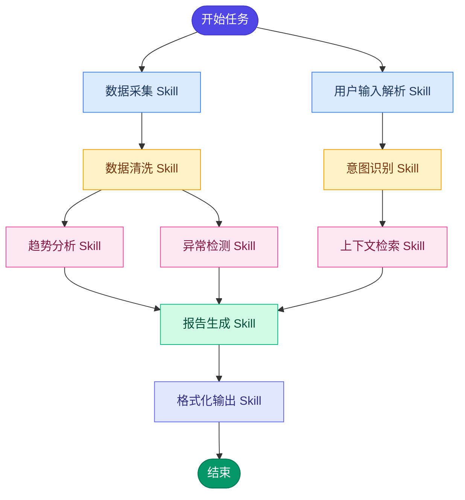

**拓扑分层解读：**
- Level 0（并行）：数据采集、用户输入解析
- Level 1（并行）：数据清洗、意图识别
- Level 2（并行）：趋势分析、异常检测、上下文检索
- Level 3：报告生成
- Level 4：格式化输出

### 2.2 流程图风格工作流

流程图是最直观的工作流表示方式，适合展示顺序执行、条件分支和循环逻辑。

**Mermaid 示例 - 条件分支工作流：**

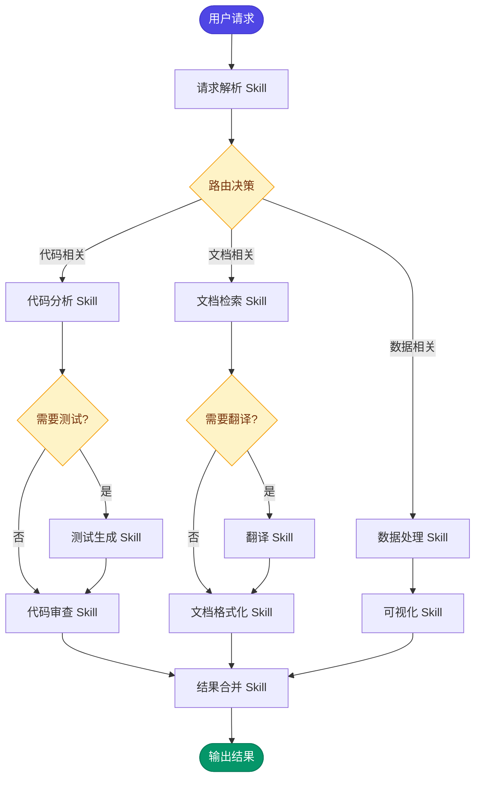

### 2.3 Skill 依赖图

依赖图专门用于展示 Skill 之间的前置条件和依赖关系，类似于软件工程中的包依赖图。

**Mermaid 示例 - Skill 依赖关系：**

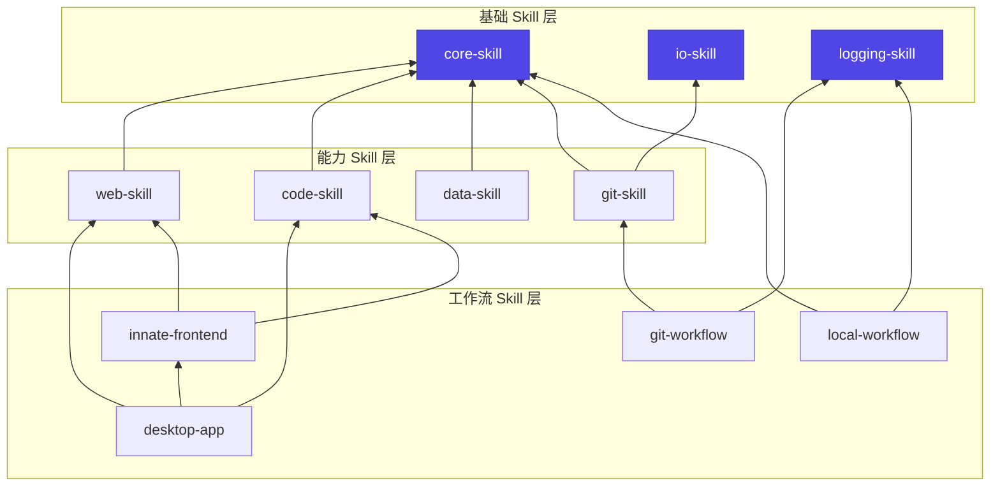

### 2.4 组合层次树

层次树用于展示 Skill 的组合嵌套关系，类似于组合模式（Composite Pattern）。

**Mermaid 示例 - 组合层次树：**

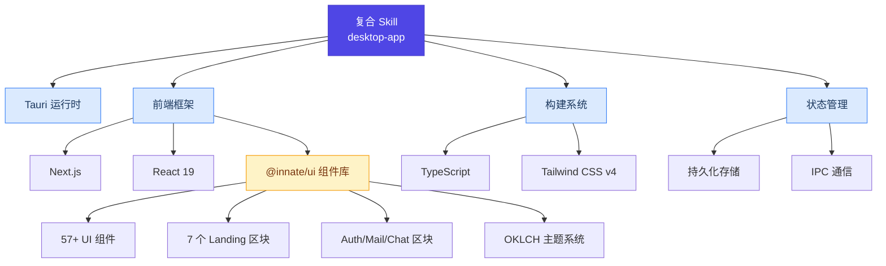

---

## 三、主流可视化工具与平台对比

### 3.1 Mermaid（Markdown 内嵌可视化）

**定位：** 文本驱动的图表渲染引擎，Markdown 原生友好

**优势：**
- 纯文本定义，可版本控制
- GitHub/GitLab/Notion 等平台原生渲染
- 支持 15+ 种图表类型
- 零依赖，轻量级
- 极其适合 Claude Code Skills 中的上下文压缩（数百 token 传达数千 token 的信息量）

**支持的图表类型与 AI 工作流适用场景：**

| 图表类型 | AI 工作流用途 |
|---------|-------------|
| Flowchart | 任务流程、条件分支、Skill 编排 |
| Sequence Diagram | Agent 间交互时序、消息传递 |
| Class Diagram | Skill 接口定义、类型关系 |
| State Diagram | Agent 状态机、工作流状态转换 |
| ER Diagram | 数据模型、知识图谱结构 |
| Mind Map | Skill 层次结构、知识树 |
| Gantt | 任务调度、时间线规划 |
| C4 Diagram | 系统架构上下文 |

**局限性：**
- 交互性有限（纯渲染）
- 大型图布局自动调整能力有限
- 不支持实时编辑和拖拽

### 3.2 LangGraph + LangFlow

**LangGraph** 是 LangChain 生态中的图编排引擎：
- 以代码定义 Agent 工作流为显式图结构
- 节点 = 函数/Agent，边 = 状态转换/数据流
- 支持条件路由、循环、状态持久化
- 适合生产级复杂多 Agent 系统

**LangFlow** 是 LangGraph 的可视化前端：
- 低代码拖拽式构建器
- 可视化设计 LangGraph 工作流
- 支持所有主要 LLM 和向量数据库
- 快速原型验证

**二者关系：** LangGraph 提供引擎（代码层），Langflow 提供界面（可视化层）

### 3.3 n8n / Zapier 式节点编辑器

**n8n：**
- 定位：自动化工作流平台，AI 能力后加
- 节点式可视化编辑器，拖拽连线
- 300+ 集成连接器
- 最强场景：数据在多系统间流转 + AI 作为其中一个步骤
- 支持自部署

**Zapier：**
- SaaS 自动化平台
- 更简单但集成更广泛
- 适合非技术用户

**对比结论：** n8n 适合运维重型自动化（AI 是工作流的一环），而非纯 AI 原生应用。

### 3.4 Dify / Flowise 式可视化工作流构建器

**Dify：**
- AI 原生设计，以 Chat/RAG 为核心
- 可视化工作流编排
- 最适合：聊天优先的 RAG 应用、初学者快速上手
- 内置模型管理、知识库管理

**Flowise：**
- LangChain 的可视化拖拽 UI
- 以 Chain 为核心构建模式
- 最适合：LangChain 式链式调用、需要可视化调试的场景
- 开源、可自部署

**三者定位对比：**

| 平台 | 核心定位 | 最佳场景 | 学习曲线 |
|-----|---------|---------|---------|
| Dify | AI 原生应用构建 | Chat-first RAG、AI 初学者 | 低 |
| Flowise | LLM Chain 可视化 | LangChain 工作流调试 | 中低 |
| n8n | 通用自动化 + AI | 多系统集成、运维自动化 | 中 |
| Langflow | LangGraph 可视化 | 多 Agent 编排原型 | 中 |
| LangGraph | 图编排引擎 | 生产级多 Agent 系统 | 高 |

### 3.5 S-DAG（学术前沿）

**S-DAG（Subject-Based Directed Acyclic Graph）** 是 AAAI 发表的学术框架：
- 将复杂任务分解为 **Subject 级别的节点**
- 每个 Subject 节点分配 **领域专业化的 LLM Agent**
- 通过 DAG 拓扑协调多 Agent 异构推理
- 使用图神经网络（GNN）识别相关 Subject 和推断依赖关系
- 代表了多 Agent 编排的前沿方向

---

## 四、Agent 编排模式与 Mermaid 图解

### 4.1 链式模式（Sequential Chain）

任务按顺序依次执行，前一步的输出是后一步的输入。


**特点：** 简单可靠、易于调试、延迟累加
**适用：** 线性依赖的任务链

### 4.2 并行模式（Parallel Fan-out/Fan-in）

多个独立任务同时执行，最终合并结果。

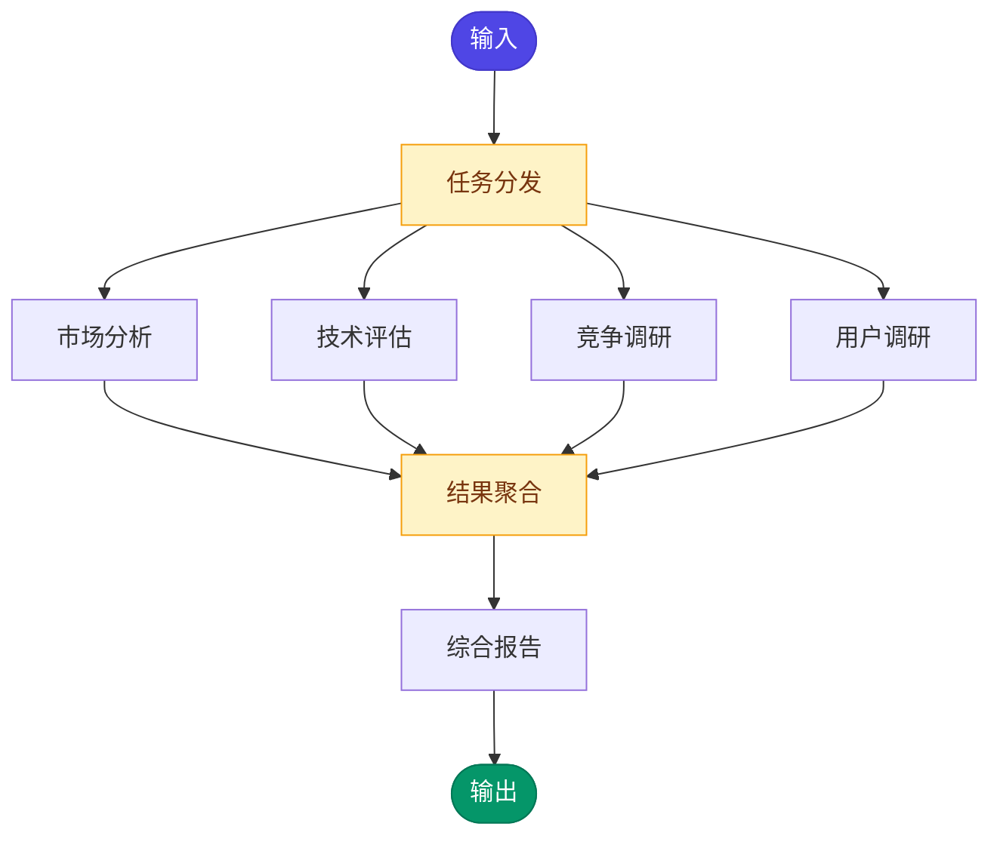

**特点：** 降低总延迟、提高吞吐、需要合并策略
**适用：** 独立可并行的子任务

### 4.3 层次编排模式（Hierarchical Orchestrator）

一个主 Agent 编排多个子 Agent，子 Agent 还可进一步委托。

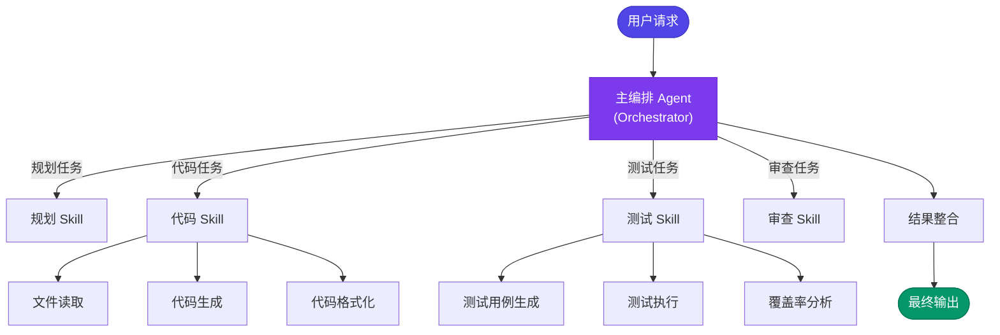

**特点：** 清晰的责任划分、可扩展、主 Agent 可做全局决策
**适用：** 复杂多步骤项目（如软件开发流程）

### 4.4 反思模式（Reflection Pattern）

Agent 执行任务后自我审查，循环改进直到满意。

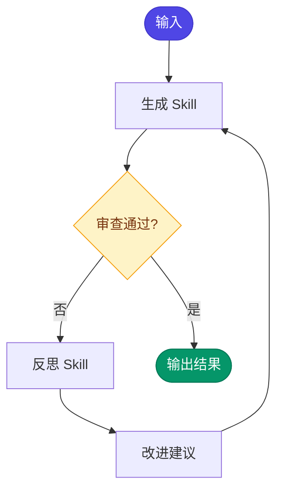

**特点：** 自我改进、质量控制、需要迭代预算
**适用：** 内容生成、代码审查等需要质量保证的场景

### 4.5 ReAct 模式（Reason + Act）

Agent 交替进行推理和行动，根据观察调整下一步。

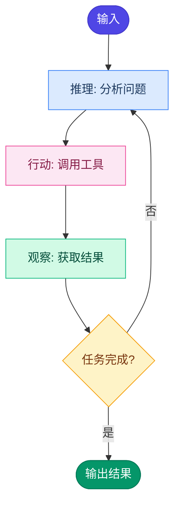

**特点：** 灵活适应、动态决策、可能需要限制迭代次数
**适用：** 探索性任务、工具使用场景

### 4.6 多 Agent 协作模式（Multi-Agent Swarm）

多个 Agent 以对等方式协作，根据任务动态选择最合适的 Agent。

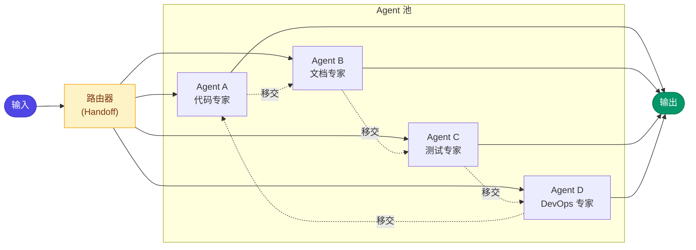

**特点：** Agent 间可互相移交任务、去中心化、弹性扩展
**适用：** 多领域协作任务

---

## 五、Claude Code Skills 可视化实践方案

### 5.1 Skill 关系可视化

在 Claude Code Skills 体系中，Skill 之间的关系主要包括：

**关系类型：**

| 关系类型 | 含义 | Mermaid 箭头 |
|---------|------|-------------|
| depends_on | 前置依赖 | `-->` |
| triggers | 触发执行 | `==>` |
| data_flow | 数据传递 | `-.->` |
| extends | 功能扩展 | `--o` |
| conflicts | 冲突互斥 | `--x` |

**Mermaid 示例 - 完整 Skill 关系图：**

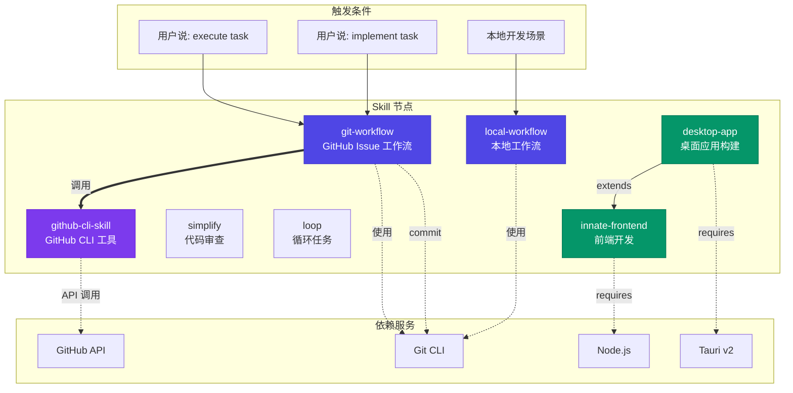

### 5.2 Skill SKILL.md 中的可视化集成

根据调研，在 Claude Code Skill 的 `SKILL.md` 文件中嵌入 Mermaid 图表是一种高效的上下文压缩方式。具体实践：

**方案一：在 SKILL.md 中嵌入工作流图**

```markdown
# my-skill

## 工作流程

\`\`\`mermaid
flowchart TD
    INPUT([触发]) --> PARSE[解析输入]
    PARSE --> EXEC[执行逻辑]
    EXEC --> OUTPUT([返回结果])
\`\`\`
```

**方案二：使用独立的可视化 Skill**

创建一个专门生成 Mermaid 图表的 Skill，当需要可视化时自动调用。

### 5.3 推荐的可视化策略

根据 Claude Code Skills 的特点（Markdown 为主、CLI 环境），推荐的可视化策略分层如下：

```
Layer 1: Mermaid 图表（基础层 - 所有 Skill 可用）
  |- Flowchart: 任务流程、Skill 编排
  |- Sequence Diagram: Agent 间交互
  |- Mind Map: Skill 层次结构
  |- State Diagram: 状态机

Layer 2: 结构化文本描述（补充层）
  |- ASCII Art 简图
  |- 表格形式的依赖矩阵
  |- YAML/JSON 格式的依赖声明

Layer 3: 外部工具集成（扩展层）
  |- 导出到 LangFlow 进行可视化编辑
  |- 生成 HTML 使用 D3.js 交互式渲染
  |- 集成 n8n 进行自动化编排
```

### 5.4 Skill 依赖声明格式建议

```yaml
# skill.yaml 依赖声明示例
skill:
  name: git-workflow
  version: 1.0.0
  description: "基于 GitHub Issue 的工作流 Skill"

dependencies:
  skills:
    - name: github-cli-skill
      version: ">=1.0.0"
      type: required
    - name: simplify
      version: ">=1.0.0"
      type: optional

triggers:
  - pattern: "execute task"
  - pattern: "implement task"
  - pattern: "run task"

outputs:
  - type: github-issue
  - type: git-commit

visualization:
  diagram: |
    flowchart TD
      TRIGGER --> CREATE_ISSUE --> IMPLEMENT --> CLOSE_ISSUE
```

---

## 六、Mermaid 高级可视化模式

### 6.1 时序图 - Agent 间交互

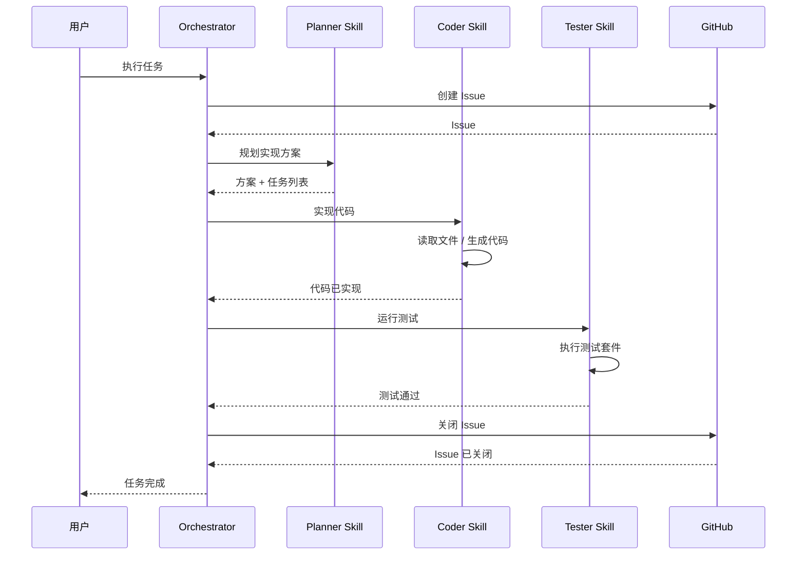

### 6.2 状态图 - 工作流状态机

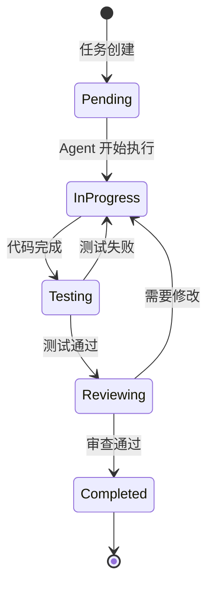

### 6.3 思维导图 - Skill 知识体系

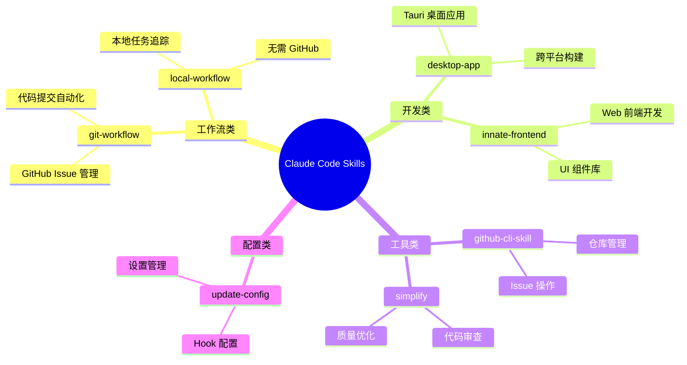

---

## 七、关键技术趋势与建议

### 7.1 当前趋势

1. **DAG 成为事实标准**：几乎所有主流 AI Agent 框架都采用 DAG 作为工作流编排的基础数据结构
2. **可视化 + 代码双轨制**：LangGraph+Langflow、Dify 等平台同时支持代码定义和可视化编辑
3. **Mermaid 作为通用可视化语言**：文本驱动、版本可控、Markdown 原生支持，成为 AI 工作流文档化的首选
4. **Skill 冲突检测需求增长**：随着 Skill 数量增加，依赖冲突可视化成为刚需
5. **S-DAG 等学术突破**：基于 Subject 的细粒度 DAG 分解代表了多 Agent 协作的新方向

### 7.2 对 Fire-Skills 项目的建议

1. **在 SKILL.md 中嵌入 Mermaid 工作流图**：作为标准实践，每个 Skill 的 SKILL.md 应包含至少一个 Mermaid 图表说明其工作流程
2. **建立 Skill 依赖声明规范**：在 Skill 的 YAML frontmatter 中声明依赖、触发条件和输出
3. **创建可视化生成 Skill**：开发一个专门的 Skill 用于自动分析项目中的 Skill 关系并生成可视化图表
4. **采用分层可视化策略**：Mermaid（基础层）-> 结构化文本（补充层）-> 外部工具（扩展层）
5. **关注 AgentSkillOS 等学术进展**：Skill 编排框架正在快速演进，保持跟踪前沿方案

---

## 八、参考资源

### 核心工具与平台
- [Mermaid 官方文档](https://mermaid.js.org/intro/syntax-reference.html)
- [LangGraph + Langflow](https://www.langflow.org/)
- [Dify AI 平台](https://dify.ai/)
- [n8n 自动化平台](https://n8n.io/)
- [Flowise](https://flowiseai.com/)

### 学术论文
- [S-DAG: Subject-Based Directed Acyclic Graph for Multi-Agent Collaboration (AAAI)](https://arxiv.org/abs/2511.06727)
- [MermaidFlow: Redefining Agentic Workflow Generation](https://openreview.net/pdf/c2c41b2611966fe4233e3c0e262ab8d27595ee40.pdf)
- [AgentSkillOS: Organizing & Orchestrating Agent Skills](https://arxiv.org/html/2603.02176v1)

### 设计模式参考
- [Agentic AI Design Patterns with Mermaid Diagrams](https://medium.com/@rohitmagluria/agentic-ai-design-patterns-explained-a-practical-guide-with-mermaid-diagrams-126b5c28022f)
- [Agentic AI Architecture Patterns](https://adasci.org/blog/agentic-ai-ai-architecture-patterns)
- [Agentic Design Patterns Interactive Tutorial](https://zeljkoavramovic.github.io/agentic-design-patterns/)

### DAG 工作流
- [DAG-Based Agent Workflows](https://callsphere.ai/blog/dag-based-agent-workflows-directed-acyclic-graphs-task-orchestration)
- [Agentic Workflows: Why the DAG is the Ultimate Design Pattern](https://www.linkedin.com/pulse/agentic-workflows-why-dag-ultimate-design-pattern-dramil-dodeja-rtkmc)
- [Practical Perspective on Orchestrating AI Agent Systems with DAGs](https://medium.com/@arpitnath42/a-practical-perspective-on-orchestrating-ai-agent-systems-with-dags-c9264bf38884)

### Claude Code Skills 生态
- [Awesome Claude Skills](https://github.com/ComposioHQ/awesome-claude-skills)
- [Mermaid Diagrams for Context Compression in Skills](https://www.mindstudio.ai/blog/mermaid-diagrams-claude-code-skills-context-compression/)
- [Best Claude Code Skills](https://firecrawl.dev/blog/best-claude-code-skills)
- [Top Claude Skills 2026](https://composio.dev/content/top-claude-skills)
- [Dependency Orchestration Skill](https://mcpmarket.com/tools/skills/dependency-orchestration)

### 平台对比
- [LangFlow vs LangGraph Comparison](https://www.zenml.io/blog/langflow-vs-langgraph)
- [Low-Code AI Agent Platforms Compared](https://rapidclaw.dev/blog/low-code-ai-agent-platforms-compared-2026)
- [Dify vs n8n Comparison](https://medium.com/generative-ai-revolution-ai-native-transformation/dify-vs-n8n-which-platform-should-power-your-ai-automation-stack-in-2025-e6d971f313a5)
